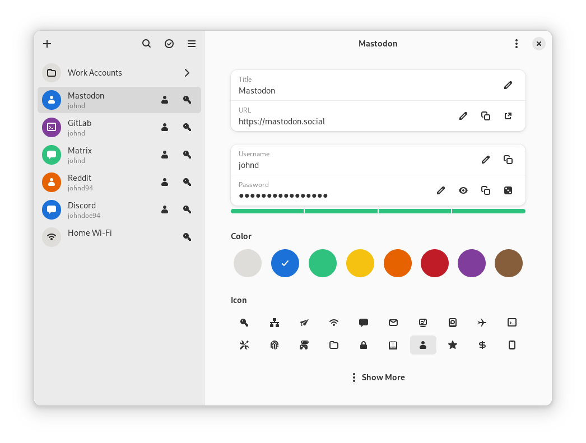

<a href="https://flathub.org/apps/details/org.gnome.World.Secrets">

</a>

# Secrets

<p>Manage your passwords</p>

Secrets is a password manager which makes use of the KeePass v.4 format. It
integrates perfectly with the GNOME desktop and provides an easy and uncluttered
interface for the management of password databases.



## Features:
* ⭐ Create or import KeePass safes
* ✨ Assign a color and additional attributes to entries
* 📎 Add attachments to your encrypted database
* 🎲 Generate cryptographically strong passwords
* 🛠 Change the password or keyfile of your database
* 🔎 Quickly search your favorite entries
* 🕐 Automatic database lock during inactivity
* 📲 Adaptive interface
* ⏱ Support for two-factor authentication

### Supported Encryption Algorithms:
* AES 256-bit
* Twofish 256-bit
* ChaCha20 256-bit

### Supported Derivation algorithms:
* Argon2 KDBX4
* Argon2id KDBX4
* AES-KDF KDBX 3.1

## Install Development Flatpak
Download the latest artifact for [x86_64](https://gitlab.gnome.org/World/secrets/-/jobs/artifacts/master/download?job=flatpak) or [aarch64](https://gitlab.gnome.org/World/secrets/-/jobs/artifacts/master/download?job=flatpak_aarch64) and extract it.
To install, open the Flatpak package with GNOME Software. Alternatively, run:
```
flatpak install --user ./org.gnome.World.Secrets.Devel.flatpak
```

## Building locally
We use the Meson build system for building. The quickest
way to get going is to run the following:
```
meson . _build
ninja -C _build
ninja -C _build install
```

## Hacking on Secrets
To build the development version of Secrets and hack on the code see the
[general
guide](https://welcome.gnome.org/en/app/Secrets/#getting-the-app-to-build) for
building GNOME apps with Flatpak and GNOME Builder.

### Translations
Helping to translate Secrets or add support to a new language is welcome.
You can find everything you need at: [l10n.gnome.org/module/secrets/](https://l10n.gnome.org/module/secrets/)

## Getting in touch
If you have any questions regarding the use or development of Secrets, please
join us on our [#secrets:gnome.org](https://matrix.to/#/#secrets:gnome.org)
channel.

## Code Of Conduct
This project follows the [GNOME Code of Conduct](https://conduct.gnome.org/).
